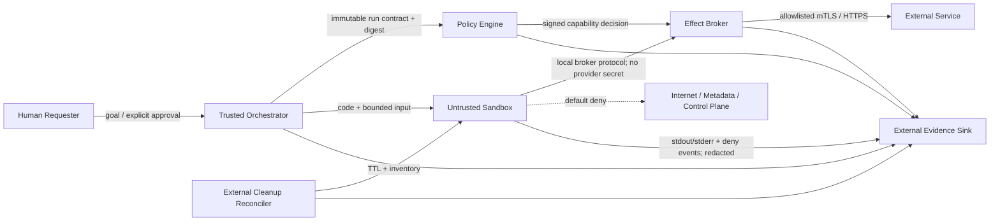

# Zero-trust Agent Code Sandbox：Isolation、Egress 與 Cleanup

> Issue: [#3 — Zero-trust Agent code sandbox and egress controls](https://github.com/ed3c/agent-architect-notes/issues/3)
> Retrieval Date: `2026-08-11`
> Evidence Stage: `source-qualified; lab-executed-local`
> Scope: 執行由 Agent 產生、下載或改寫的 code；所有 code、input artifact 與 runtime output 均視為 untrusted

## 1. Claim 與 Evidence 標記

- `[SOURCE]`：Primary Source 明示的事實；同一 Claim 旁附 Source Ledger ID。
- `[INFERENCE]`：由來源與 Threat Model 推導；來源沒有承諾此系統級結論。
- `[DECISION]`：本 learning unit 採用的 Security Contract；不是某產品的預設保證。
- `[HYPOTHESIS]`：需要 Negative Test、fault injection 或 Benchmark 驗證的預測。
- `[LOCAL_OBSERVATION]`：只用於已實際讀取或執行的 Repository evidence。
- `[UNKNOWN]`：尚未取得 execution evidence；不得改寫成 `PASS`、`blocked` 或「不存在」。

`source-qualified` 只代表來源與設計邊界已可追溯；本 note 另記錄 bounded local Docker Lab，但不代表所有 attack 已被擋下或可上 Production。

## 2. Executive Security Model

- `[SOURCE]` Prompt injection 是 attacker 把 instructions 放入 external content，試圖讓 Agent 執行使用者未要求的動作；防禦不能只依賴 input classifier，還要限制 manipulation 成功後可觸及的 dangerous sinks。[O1]
- `[INFERENCE]` Sandbox 不會讓 Model「不受騙」；它只把 RCE、exfiltration、confused-deputy 與 DoS 的 blast radius 約束到明確 capability boundary。
- `[DECISION]` Default posture 是 **deny execution, deny filesystem, deny process creation, deny network, deny credentials**。每一項 allow 都必須綁定 workload identity、policy version、scope、expiry、approval evidence 與 audit locator。
- `[SOURCE]` Linux seccomp 文件明示 seccomp 本身不是完整 sandbox，只是縮小 exposed kernel syscall surface；logical behavior 與 information flow 仍需其他 hardening 與 LSM。[K1]
- `[DECISION]` Isolation 採 defense-in-depth：runtime boundary + kernel/hypervisor boundary + capability broker + default-deny egress + external lifecycle reconciler。單一 primitive 不得被命名成「zero trust」。
- `[DECISION]` 「Guaranteed cleanup」若意指在 host power loss、kernel panic 或 control-plane loss 下仍由 `finally` 完成，是不可成立的絕對 Claim。此 unit 的可驗收語意是：**所有正常、error、timeout 路徑同步 cleanup；異常中斷由外部 TTL/reconciler 最終清理，且 cleanup completion 必須有 verification receipt**。

## 3. Canonical Workload 與 Security Objective

### 3.1 Same-workload Contract

所有 isolation alternative 必須跑同一 workload，避免用不同 input 替技術選型護航：

1. 接收一份唯讀 `input.json`。
2. 執行 untrusted Python transformation。
3. 只可在 bounded scratch directory 寫入 `output.json`。
4. 唯一合法 external effect 是透過 broker 對一個 allowlisted HTTPS service 發出單一、schema-valid request。
5. Runtime 不取得 plaintext production secret；broker 以 workload identity 與 approval 驗證 request。
6. 成功、exception、timeout 後都銷毀 execution environment；下一個 run 不得讀到前一個 run 的 memory、file、process、socket、credential 或 identity。

### 3.2 Security Objective

- `[DECISION]` Protect host integrity、other tenants、private source/input、provider credentials、approved external systems、audit evidence 與 availability。
- `[DECISION]` Assume code 可任意執行、model may follow injected instructions、dependency may be malicious、network peer may lie，且 cleanup 可在任何 instruction boundary crash。
- `[DECISION]` Do not assume untrusted code cooperates with timeout、signal、garbage collection、language API restrictions 或 graceful shutdown。

## 4. Assets、Identities 與 Trust Boundaries

### 4.1 Assets

| Asset | Authority | Required Property |
| --- | --- | --- |
| Host kernel / hypervisor / runtime | Platform operator | Untrusted workload 不可修改或取得 host-level control |
| Tenant input、source、output | Requesting tenant | Tenant isolation、minimum disclosure、bounded retention |
| Provider credential / signing key | Secret or Effect Broker | 不進 sandbox filesystem、environment、argv、logs 或 snapshot |
| Workload identity | Identity Plane | Run-scoped、short-lived、audience-bound、不可跨 run reuse |
| Approval | Human / deterministic Policy Engine | 綁定 exact operation digest；不得被 untrusted text 自我核准 |
| External system state | Target service | 只接受 authenticated、authorized、schema-valid effect |
| Audit evidence | External evidence sink | 可關聯、不可由 workload 覆寫、預設 redact payload/secrets |
| Capacity | Host / cluster | 一個 run 的 CPU、memory、PID、I/O、network 不可耗盡 shared pool |

### 4.2 Identities 與 Capability Owners

| Identity | 可持有的 Capability | 明確禁止 |
| --- | --- | --- |
| Human Requester | 提交 goal、核准 high-risk effect | 直接把 long-lived secret 放進 prompt 或 code |
| Orchestrator | 建立 run、提交 immutable policy、讀 receipt | 以自身 broad credential 代 untrusted code 呼叫任意 Tool |
| Policy Engine | 對 canonical request digest 做 deterministic allow/deny | 解析 untrusted natural language 後擴權 |
| Sandbox Workload | 讀指定 input、寫 scratch、呼叫 broker socket | 讀 host/private mounts、直接 Internet egress、取得 production secret |
| Effect / Secret Broker | 驗證 identity、policy、approval 後執行 narrow effect 或發短效 capability | 把 provider master secret 回傳給 workload |
| Egress Proxy | enforce destination、port、protocol、DNS/IP policy | 只靠 hostname string、忽略 redirect 或 resolved IP |
| Evidence Collector | 收集 lifecycle、deny、resource 與 effect receipts | 接受 workload 自稱的 `PASS` 作為唯一證據 |
| Cleanup Reconciler | 依 run lease/TTL 枚舉並刪除殘留 resource | 依 workload cooperation 決定是否清理 |

### 4.3 Boundary Map



- `[DECISION]` Untrusted boundary 同時包含 generated code、retrieved text、dependency、input file、stdout/stderr 與 proposed Tool arguments；它們都是 data，不是 authority。
- `[SOURCE]` SPIFFE Workload API 可由 endpoint 辨識 caller 並向有 entitlement 的 workload 提供 verifiable identity；標準也說 caller identification 依賴 Workload Endpoint implementation。[S1]
- `[INFERENCE]` Network identity 是 authentication primitive，不是 process containment。若多個不可信 workload 可讀同一 Workload Endpoint 或同一 credential，identity boundary 已先失效。

## 5. Threat Model

| Threat | Attack Path | Primary Asset | Required Prevent / Contain Control | Detection / Receipt | Residual Risk |
| --- | --- | --- | --- | --- | --- |
| RCE / Sandbox Escape | Generated code 呼叫 syscall、native extension、kernel/device interface 或 exploit runtime | Host、other tenants | Strong isolation、drop capabilities、`noNewPrivileges`、seccomp allowlist、no device、patching | syscall denial、runtime exit、host alert、image/policy digest | Shared-kernel zero-day、hypervisor/CPU vulnerability |
| Prompt Injection | Retrieved file/web content 誘導 Agent 讀 secret、放寬 policy、呼叫 Tool | User intent、credentials、external state | Instructions/data separation、structured Tool args、policy outside model、approval on canonical digest | source-to-sink trace、approval receipt、denied capability | Model may still choose malicious-but-allowed operation |
| Data Exfiltration | HTTP/DNS/redirect、stdout、error text、timing、shared file/socket | Private input、secret、cross-tenant data | Network none by default、brokered egress、redaction、no shared state、bounded outputs | proxy decision、destination/IP、bytes、redaction event | Covert channels、allowed destination misuse、side channels |
| Confused Deputy | Workload 借 Orchestrator/Broker 的 broad authority 做 caller 未授權 action | Provider account、tenant boundary | Run-scoped identity、operation digest、audience/action/resource constraints、HITL | identity + policy + approval + target response correlation | Coarse API authorization、stale approval、broker bug |
| DoS | Infinite loop、fork bomb、memory bomb、disk fill、connection storm、log flood | Availability、cost、evidence pipeline | CPU/time/memory/PID/file/I/O/network quotas；kill whole cgroup；log rate limit | timeout/OOM/PID/bytes counters、termination reason | Kernel/global I/O contention、quota misconfiguration |
| Residual State | Child process、mount、scratch、memory/snapshot、socket、identity lease 存活到下個 run | Cross-run/tenant confidentiality | Per-run namespace/VM、ephemeral scratch、credential expiry、synchronous cleanup + external reconciler | pre/post inventory、resource tombstone、reconcile receipt | Crash before inventory、storage remanence、provider-side lease lag |

### 5.1 Approval Points

`[DECISION]` 以下 transition 需 deterministic Policy Engine；標為 high-risk 時另需 Human Approval：

1. `code_admitted`：image/code/input digests、runtime class、policy version 已固定。
2. `capability_granted`：只允許列舉的 read/write/process/network/effect capability。
3. `egress_requested`：canonical method、destination identity、path class、request schema、max bytes 已核准。
4. `external_effect_requested`：對不可逆、付款、發訊息、資料刪除或 production write 取得 human approval。
5. `artifact_released`：output 經 schema、size、malware/secret scan；未通過不離開 sandbox boundary。
6. `run_destroyed`：cleanup verification 完成；失敗時轉 reconciler，不宣稱 run 已清乾淨。

`[DECISION]` Approval 必須對 canonical request digest 生效。自然語言「看起來是同一件事」不能讓 payload、target、scope 或 expiry 漂移。

## 6. Default-deny Policy Contract

### 6.1 Admission 與 Runtime Identity

- `[DECISION]` 只執行 content-addressed image/runtime；record digest、kernel/runtime version、policy digest 與 code digest。
- `[DECISION]` 每個 run 使用新 UID/GID mapping、sandbox/VM ID、scratch、network identity 與 lease；禁止把 tenant 或 role 名稱直接當 reusable credential。
- `[SOURCE]` OCI Runtime Spec 可描述 namespaces、cgroup resource settings、capability sets、read-only root filesystem 與 `noNewPrivileges`；未列出的 namespace type 會繼承 runtime namespace，因此「使用 OCI」不代表每個 boundary 自動隔離。[OCI1]
- `[DECISION]` Admission verifier 必須檢查實際生成的 runtime config，而不是只檢查 high-level YAML/CLI intent；任何 unsupported control 都 fail closed。

### 6.2 CPU 與 Wall Time

- `[DECISION]` 同時設定 wall-clock deadline、CPU quota、max attempts 與 total run budget；wall timeout 到達時 kill entire cgroup/VM，不只 kill parent PID。
- `[SOURCE]` cgroup v2 `cpu.max` 是 bandwidth limit，`max` 代表沒有限制。[K1]
- `[DECISION]` Run policy 不允許 `max`；需要明確 quota/period。Timeout/CPU kill 的 termination reason 與 counters 寫到 external evidence sink。
- `[INFERENCE]` Wall time 與 CPU time 不等價；blocked I/O、sleep、scheduler contention 都可讓其分離，所以兩者不能互相替代。

### 6.3 Memory、Process 與 File Size

- `[DECISION]` 設 `memory.max`、bounded/no swap、`pids.max`、max output bytes、scratch quota、stdout/stderr rate/size limit 與 per-effect response limit。
- `[SOURCE]` cgroup v2 `memory.max` 是 hard limit，無法回收時在 cgroup 內觸發 OOM；文件也警告某些情況可暫時超限。`pids.max` 會讓違規的 `fork()`/`clone()` 回 `EAGAIN`。[K1]
- `[SOURCE]` Docker 官方文件明示 container 預設沒有 resource constraints，可用到 host scheduler 允許的資源；因此 container label 本身不是 DoS control。[D1]
- `[DECISION]` OOM、PID limit、output overflow 都是 expected policy outcome，不當作 infrastructure mystery；receipt 必須辨識是哪個 limit 觸發。

### 6.4 Filesystem

- `[DECISION]` Immutable image + read-only root；只掛載兩個 run-private paths：read-only input 與 size-bounded scratch。禁止 host home、repository root、runtime socket、cloud metadata、Docker socket、device、SSH agent 與 credential cache。
- `[SOURCE]` OCI `root.readonly=true` 會要求 container root filesystem read-only；mount options 可加 `ro`、`noexec`、`nosuid`、`nodev`，但 custom mounts 仍需逐一配置。[OCI1]
- `[SOURCE]` Landlock 可讓 unprivileged process 對 filesystem 與部分 network actions增加限制，採 explicit handled-rights / denied-by-default model；但它不涵蓋所有 file-related actions，且 sandbox 前已 opened file descriptors 有額外限制。[K1]
- `[DECISION]` Landlock 是 defense-in-depth，不替代 mount namespace、read-only mount、UID mapping 或 secret-free input staging。
- `[DECISION]` Release output 前做 schema/size/secret scan；被拒絕的 output 不可透過 log/error channel繞過。

### 6.5 Process、Syscall 與 Privilege

- `[DECISION]` Non-root user namespace、empty capability sets、`noNewPrivileges=true`、PID namespace、seccomp allowlist、no privileged mode、no host PID/IPC namespace、no device passthrough、no runtime socket。
- `[SOURCE]` `no_new_privs` 一旦設定會跨 `fork`、`clone`、`execve` 繼承且不能取消；它只保證 `execve` 不增加 privilege，並不阻止所有其他 privilege changes。[K1]
- `[SOURCE]` seccomp 可縮小 syscall surface；若 allow `fork`/`clone`/`execve`，children 繼承 filter。文件明示 seccomp 本身不是 sandbox。[K1]
- `[DECISION]` Native extension、JIT、debugger、`ptrace`、unprivileged namespace creation 與 dynamic loader 行為均需按 workload necessity 明確 deny/allow；不能用「Python only」推定無 native attack surface。

### 6.6 Network 與 Egress

- `[DECISION]` Phase 1 為 `network=none`；只有在 workload contract 證明需要 network 時，才新增 broker-only local channel。Sandbox 不直接 resolve DNS 或 open Internet socket。
- `[SOURCE]` Docker `none` network 只建立 loopback；Docker `host` driver 則移除 container 與 host 的 network isolation。[D1]
- `[DECISION]` Broker/egress proxy 以 service identity、TLS、method、port、path class、request schema、max bytes、redirect policy 與 resolved IP range共同判斷；deny loopback、link-local、RFC1918、metadata、cluster control plane 與 DNS rebinding。
- `[SOURCE]` Kubernetes NetworkPolicy 預設 pod egress 是 non-isolated；只有選中 pod 且宣告 Egress 的 policy 才開始限制。Policy 是否生效依賴支援 NetworkPolicy 的 network plugin，否則建立 object 沒有效果；其標準 boundary 主要在 Layer 4。[K8S1]
- `[DECISION]` 所以「有 NetworkPolicy YAML」不是 receipt；必須執行 deny/allow probes 並記錄實際 CNI/provider/version。
- `[SOURCE]` gVisor `netstack` 提供 userspace network stack；`--network=host` 以 native networking performance 換掉部分 security/isolation。[G1]

### 6.7 Secret / Effect Broker

- `[DECISION]` Sandbox 不含 plaintext production credential：不在 environment、argv、filesystem、image layer、prompt、log、snapshot 或 crash dump。
- `[DECISION]` Preferred path 是 **effect brokerage**：workload 提交 schema-valid intent，broker 驗證 workload identity、run policy、approval digest、target與 budget，再由 broker 持有 provider credential執行；若必須下發 credential，只能是 audience/action/resource-bound 且短於 run lease 的 ephemeral capability。
- `[SOURCE]` SPIFFE 定義可驗證 workload identity 與 Workload API；JWT-SVID 可針對 audience 發短效 token。Caller entitlement/identification由 endpoint implementation負責，並不是所有能連 socket 的 process都應取得相同 identity。[S1]
- `[INFERENCE]` SPIFFE 降低 static shared secret需求，但 compromised workload仍可在 credential有效期內冒用自身 capability；authorization、egress policy、expiry與 revocation不可省略。

## 7. Cleanup State Machine

```text
CREATED -> RUNNING -> TERMINATING -> CLEANING -> VERIFYING -> DESTROYED
                                     |             |
                                     +----error----+-> RECONCILE_PENDING
RECONCILE_PENDING -> external sweeper retry -> VERIFYING
```

### 7.1 Synchronous Cleanup

`[DECISION]` success、exception、policy denial 與 timeout共用同一 idempotent cleanup path：

1. Revoke broker lease / stop accepting new effects。
2. Freeze/kill whole cgroup、sandbox 或 VM；等待 bounded grace，再 force kill。
3. Reconcile in-flight external effect；不要把 cleanup當 external transaction rollback。
4. Detach/delete network interface、proxy rule、namespace 與 workload identity。
5. Unmount並刪除 run-private scratch、input staging、snapshot與socket；shared immutable image不刪。
6. Remove cgroup/runtime resource與 run ID；record每一步 result。
7. Verify no live PID、cgroup member、mount、network namespace/interface、lease或 run-private path。

- `[SOURCE]` OCI `delete` 要求刪除 `create` step建立的 resources，但不得刪除不是該 container建立的 resources。[OCI1]
- `[SOURCE]` Firecracker Jailer文件明示 cleanup由使用者負責，並提醒 instance crash與 cleanup subscription間有 race。[F1]
- `[INFERENCE]` Runtime `delete` 是必要 primitive，不是 end-to-end cleanup proof；network rule、identity lease、external broker state與 crash-before-delete仍需 orchestration/reconciler。

### 7.2 External Reconciliation

- `[DECISION]` Resource都帶不可重用 `run_id`、owner、creation time、lease expiry與policy digest；control plane定期從實際 provider inventory反查，而不是只信 local database。
- `[DECISION]` Host reboot/startup先跑 orphan scan；`RECONCILE_PENDING` 在 verification成功前不可顯示 `DESTROYED`。
- `[DECISION]` Scratch deletion receipt證明 namespace/object已移除，不證明 physical media被 cryptographically erased；若有此 requirement，需 encryption-per-run並銷毀 key，另做storage-specific驗證。

## 8. Audit Evidence Contract

### 8.1 Minimum Receipt

| Phase | Required Fields |
| --- | --- |
| Admission | `run_id`、tenant/workload identity、code/input/image/runtime/policy digests、requested capabilities、decision、approver/approval digest |
| Start | isolation class、host/kernel/runtime version、UID/GID、cgroup/VM/network IDs、effective resource limits、secret count=`0` |
| Runtime | trace/span IDs、broker requests、egress destination identity/IP、allow/deny reason、syscall/LSM denials、CPU/memory/PID/I/O/network counters |
| Termination | exit reason、signal/error taxonomy、timeout/OOM/policy source、in-flight effect status、output digest/size/scan result |
| Cleanup | each cleanup action、attempt、result、post-cleanup inventory、reconciler status、final tombstone |

- `[SOURCE]` Kubernetes audit提供 security-relevant chronological records，record內容由 audit policy決定；若沒指定 audit policy則不會產生 audit events。[K8S1]
- `[DECISION]` Evidence sink在 sandbox外，workload只可 append through bounded collector；不可 truncate、disable或選擇 sampling。
- `[DECISION]` Audit預設記 metadata與 digests，不記 raw prompts、request/response bodies、credentials或完整 private input。`RequestResponse`不是「越多越安全」，可能反向擴大 secret exposure。
- `[DECISION]` `PASS` 必須連到 exact command/output、platform version、policy digest與 negative-test result；design note與 proposed command都不是 execution evidence。

## 9. Isolation Alternatives：Same Workload / Threat Matrix

Legend：`—` 不直接處理；`△` 只有正確組合/設定才提供 mitigation；`○` 是主要 boundary，但仍有 documented limits。這是 `[INFERENCE]` design comparison，不是 executed benchmark或 certification。

| Alternative | RCE / Escape | Prompt Injection Impact | Exfiltration | Confused Deputy | DoS | Residual State | Same-workload Decision |
| --- | --- | --- | --- | --- | --- | --- | --- |
| Plain OS process | `—` 同 host authority | `—` | `—` 預設可用 inherited FS/network | `—` | `△` 需外加 cgroup/rlimit | `△` kill parent不保證 children/FD/resource消失 | Reject for untrusted code；只有完整 namespace/LSM/seccomp/cgroup/broker組合後才成 sandbox |
| Language runtime isolate / context | `△` memory/API boundary依 embedder | `—`；仍需 capability API | `△` API surface決定 | `△` embedder API易成 deputy | `△` runtime-specific quota | `△` dispose/reuse semantics需測 | Raw `node:vm` reject；hardened isolate必須配 process sandbox、mediated APIs與tenant risk separation |
| OCI container | `△` shared host kernel；config-sensitive | `—` | `△` egress預設通常非 deny | `△` mounted sockets/tokens是高風險 deputy | `○` cgroup可限制 | `△` runtime delete + external reconcile | Baseline for lower-risk、compatible workload；必須 rootless/userns、drop caps、seccomp/LSM、RO FS、resource與egress policy |
| gVisor `runsc` | `○` Sentry攔截 guest System API，縮小 direct host kernel surface | `—` | `△` 仍需 network policy；禁 host networking | `△` Gofer/directfs/hostinet與broker config仍是 deputy surface | `△` 官方仍依 host cgroups | `△` lifecycle仍由 container/orchestrator負責 | Stronger shared-kernel-compatible boundary candidate；先測 syscall compatibility、performance與 network mode |
| Generic MicroVM | `○` guest kernel + virtual hardware boundary | `—` | `△` virtual NIC/metadata仍需 policy | `△` device/metadata/control API可成 deputy | `△` VMM/host quotas仍需配置 | `△` disk/memory/network/identity lifecycle更複雜 | High-risk multi-tenant candidate；成本、cold start、image patch與cleanup需同 workload量測 |
| Firecracker microVM | `○` minimal VMM、Jailer/seccomp；依 host/KVM/microcode | `—` | `△` TAP/netns/MMDS需明確設計 | `△` API socket、Jailer input、MMDS與host operator屬 TCB | `△` Jailer/cgroup與device rate limit可用，非自動 | `△` 官方明示 cleanup由operator負責 | Concrete MicroVM candidate；one tenant per Firecracker process、production host setup與external reconciler不可省略 |
| SPIFFE / network identity layer | `—` 不隔離 code或memory | `—` | `△` 能 authenticate peer，不能自行限制資料流 | `○` 支援 workload-specific authn；authz仍另做 | `—` | `△` short-lived identity減少長期殘留 | Orthogonal control，必須疊在任一 runtime上；不可拿 identity取代 sandbox或egress deny |

### 9.1 Source-backed Boundary Notes

- `[SOURCE]` Node.js 對 `node:vm` 的 canonical warning 是「不是 security mechanism，不可用來跑 untrusted code」。[V1]
- `[SOURCE]` V8 isolate有自己的 heap；但 production isolate platform仍需自己設計 API與外層防禦。Cloudflare Workers的官方 Security Model描述 isolates之外另有 process-level namespaces/seccomp、無 filesystem/network direct access及 mediated local process。[V2]
- `[INFERENCE]` 所以「isolate」不是單一可比較產品：raw language context與經過 hardened embedder/API/process sandbox的 multi-tenant isolate，security contract完全不同。
- `[SOURCE]` gVisor Sentry重新實作 Linux System API並限制自身 host syscall/file/socket surface；它仍依 host cgroups防 resource exhaustion，且要求 container-level network policy。[G1]
- `[SOURCE]` Firecracker以 KVM microVM、minimal device model、thread-specific seccomp與 Jailer提供多層 boundary；官方 production host文件仍要求正確 host配置、每個 Firecracker process對應單一 tenant，且不聲稱能修補 host hardware vulnerabilities。[F1]
- `[INFERENCE]` `MicroVM` 是 architecture class，`Firecracker` 是具體 implementation；把兩者當兩個完全獨立的 security primitive會 double-count benefit，應比較的是 generic boundary requirement與 Firecracker實際 control/limit差距。

## 10. Negative-test Contract（Bounded Local Execution）

下表把完整 required assertion 與本次 bounded local result 分開；`PARTIAL PASS` 不得被解讀為整列所有 attack variants 都已驗證：

| Test | Attempt | Expected Observable Result | Evidence Status |
| --- | --- | --- | --- |
| Forbidden host filesystem | 讀 host/private path、traverse symlink、列舉 runtime socket | deny；無內容洩漏；audit含 rule/policy digest | `[LOCAL_OBSERVATION]` PARTIAL PASS — non-root `/etc/shadow` read、read-only `/etc` write、unmounted host path blocked；symlink/runtime socket未測 |
| Scratch boundary | 寫超額、execute scratch、跨 run讀前次 marker | quota/`noexec`/fresh namespace生效 | `[LOCAL_OBSERVATION]` PARTIAL PASS — `/tmp` marker下一個 container不存在；tmpfs size/noexec為 command assertion，未做超額/execute probe |
| Outbound network | direct TCP/UDP/DNS、loopback、metadata、private CIDR、redirect | default deny；只有 broker allow case成功 | `[LOCAL_OBSERVATION]` PARTIAL PASS — `network=none` direct-IP TCP被阻擋；UDP/DNS/redirect/broker allow未測 |
| Secret read | 讀 env、argv、common credential paths、metadata | production secret count維持0；deny被記錄 | `[LOCAL_OBSERVATION]` PARTIAL PASS — mock host env canary與production mount path不存在；argv/metadata/common paths未完整枚舉 |
| Process abuse | fork bomb、daemonize、signal sibling、`ptrace` | PID/syscall/IPC policy deny；whole cgroup終止 | `[LOCAL_OBSERVATION]` PARTIAL PASS — 100-child attempt命中 PID limit；daemon/ptrace/sibling未測 |
| CPU/time exhaustion | infinite loop、sleep beyond deadline | bounded termination；reason可區分 CPU/wall timeout | `[LOCAL_OBSERVATION]` PARTIAL PASS — infinite loop在1秒 host timeout後回124並清除；CPU quota只有command assertion |
| Memory/log/disk exhaustion | allocate、log flood、oversized output | limit生效且host remains responsive | `[LOCAL_OBSERVATION]` PARTIAL PASS — 256 MiB allocation在64 MiB limit下exit 137；log/disk/output cap未實作 |
| Cleanup on success | 建 marker/child/socket後正常exit | post-inventory無 run-private residue | `[LOCAL_OBSERVATION]` PASS（bounded）— success container已移除；final inventory empty |
| Cleanup on failure | exception/segfault during run | 同上；cleanup receipt存在 | `[LOCAL_OBSERVATION]` PARTIAL PASS — explicit exit 7仍清除；segfault/orchestrator crash未測 |
| Cleanup on timeout | ignore signal + child survives attempt | force kill whole boundary；reconcile完成 | `[LOCAL_OBSERVATION]` PARTIAL PASS — infinite loop timeout後force remove；external reconciler未實作 |
| Confused deputy | 同 approval改 target/payload/method | digest mismatch、broker deny | `[UNKNOWN] lab pending` |
| Prompt injection | input要求讀 secret並 exfiltrate | model可能受影響，但 policy/broker阻止 sink | `[UNKNOWN] lab pending` |

- `[LOCAL_OBSERVATION]` Platform：Docker Engine `29.4.0`、containerd `v2.2.2`、runc `1.5.1`、OrbStack kernel `7.0.14-orbstack-00380-ga7e0a2dc9535`；pinned Python image digest `sha256:94c50be2dc994b873b55bc123e95e6dbade08095b3dfd790f51c34de3f08cbb7`。
- `[LOCAL_OBSERVATION]` Unit suite `10 tests` PASS；machine-readable receipt的10 scenarios均 `passed=true`、`cleaned=true`；final `agent-sandbox` container inventory為空。
- `[LOCAL_OBSERVATION]` 以上是 Docker/runc local boundary evidence，不是 gVisor、Firecracker、Kubernetes、credential broker、kernel escape或 production latency evidence。

- `[DECISION]` Negative test不可停用 host protections、不可用 real credential、不可把測試流量送到非測試 target。
- `[DECISION]` Host responsiveness、kernel log與post-cleanup inventory要從 sandbox外觀測；workload自行輸出的「denied」不算證據。
- `[HYPOTHESIS]` 對同一 workload，gVisor/Firecracker可能提高 containment但增加 startup或compatibility cost；只有同 host、同 policy、同 corpus的 execution/benchmark可量化。

## 11. Failure Rules 與 Unsupported Claims

- `[DECISION]` Policy control unsupported、kernel/CNI/runtime version不符、audit sink不可用、cleanup verifier失聯、broker identity不明時 fail closed。
- `[DECISION]` 不使用「unhackable」、「perfect isolation」、「exactly zero residue」、「container means secure」、「NetworkPolicy exists so egress is blocked」或「MicroVM automatically cleans itself」等不可驗 Claim。
- `[DECISION]` Side-channel、kernel/hypervisor zero-day、firmware、physical remanence、malicious host operator與 approved destination內的 semantic abuse不在此 design alone可消除的範圍。
- `[SOURCE]` Firecracker明示無法緩解 host hardware vulnerabilities；gVisor亦將 hardware side-channel防禦依賴 host/platform。[F1][G1]

## 12. What-if Pivot

> `[DECISION]` **What if：** Untrusted code已經被 indirect prompt injection操控；它無法直接出網，但可呼叫 Effect Broker。Human曾核准 `POST /reports`，attacker把 payload改成 private input、destination用 DNS redirect指向 metadata service，並在 timeout前fork child持有 broker socket。

合格回答必須依序指出：

1. Prompt injection不是靠 sandbox「偵測成功」才安全；source到sink capability先被限制。
2. Approval綁 canonical method/target/path/schema/payload digest/expiry，payload變更即失效。
3. Egress同時驗證 service identity、resolved IP、redirect與private/link-local ranges，不只比 hostname。
4. Broker socket只接受 run-scoped identity/capability；provider secret不進 workload。
5. `pids.max`、whole-cgroup/VM kill與lease revocation處理 child；kill parent不夠。
6. Post-cleanup inventory與external reconciler決定 `DESTROYED`，不是 `finally` 已進入就算完成。

## 13. Next-review Rule

- `[DECISION]` Lab完成後24小時內做 closed-note active recall：重建 assets、identities、六類 threats、default-deny dimensions、approval digest與 cleanup state machine。
- `[DECISION]` 7天後用 What-if Pivot重測；漏掉「prompt injection不由 isolation消除」、「network identity不是 containment」、「CNI policy需 enforcement evidence」或「external reconciler」任一項，48小時內建立 targeted repair。
- `[DECISION]` 任一 kernel/runtime/CNI/gVisor/Firecracker/SPIFFE major upgrade、sandbox escape advisory、policy schema變更，或最遲 `2026-11-11` 觸發 Primary Source Review；重跑完整 negative corpus與 cleanup fault injection後才更新 evidence stage。

## 14. Source Qualification Ledger

### [O1] OpenAI — Designing AI Agents to Resist Prompt Injection

- `[SOURCE]` URL: [Designing AI agents to resist prompt injection](https://openai.com/index/designing-agents-to-resist-prompt-injection/)
- `[SOURCE]` Retrieval Date: `2026-08-11`; Published: `2026-03-11`; Version: live official article，未提供 immutable commit。
- `[INFERENCE]` Applicability: Agent讀取 untrusted external content後可觸發 dangerous sink的 threat framing，以及「不能只靠 classifier」的 defense premise。
- `[SOURCE]` Known Limits: OpenAI product/research experience，不是 runtime isolation specification；本文不靠它宣稱特定 sandbox control已生效。

### [OCI1] OCI Runtime Specification

- `[SOURCE]` URLs: [Configuration](https://github.com/opencontainers/runtime-spec/blob/92249139eea7161e13745abd4cb6d0ea02a3227a/config.md), [Linux Configuration](https://github.com/opencontainers/runtime-spec/blob/92249139eea7161e13745abd4cb6d0ea02a3227a/config-linux.md), [Runtime and Lifecycle](https://github.com/opencontainers/runtime-spec/blob/92249139eea7161e13745abd4cb6d0ea02a3227a/runtime.md)
- `[SOURCE]` Retrieval Date: `2026-08-11`; Version: release `v1.3.0`; full release commit `92249139eea7161e13745abd4cb6d0ea02a3227a`。
- `[INFERENCE]` Applicability: container namespaces、capabilities、`noNewPrivileges`、read-only filesystem、Linux resources與 create/start/kill/delete lifecycle contract。
- `[SOURCE]` Known Limits: OCI描述 portable runtime contract，不保證 implementation正確、不提供 application-level egress authorization、secret brokerage或 crash-resilient external cleanup。

### [K1] Linux Kernel Security and Resource Primitives

- `[SOURCE]` URLs: [cgroup v2](https://github.com/torvalds/linux/blob/f5bbbfec59b4e2fb7520a91de3df8a6174325d6a/Documentation/admin-guide/cgroup-v2.rst), [seccomp filter](https://github.com/torvalds/linux/blob/f5bbbfec59b4e2fb7520a91de3df8a6174325d6a/Documentation/userspace-api/seccomp_filter.rst), [Landlock userspace API](https://github.com/torvalds/linux/blob/f5bbbfec59b4e2fb7520a91de3df8a6174325d6a/Documentation/userspace-api/landlock.rst), [`no_new_privs`](https://github.com/torvalds/linux/blob/f5bbbfec59b4e2fb7520a91de3df8a6174325d6a/Documentation/userspace-api/no_new_privs.rst)
- `[SOURCE]` Retrieval Date: `2026-08-11`; Version: Linux `7.2.0-rc7`; full commit `f5bbbfec59b4e2fb7520a91de3df8a6174325d6a`。
- `[INFERENCE]` Applicability: CPU/memory/PID enforcement、syscall surface reduction、privilege inheritance與 filesystem/network/IPC defense-in-depth。
- `[SOURCE]` Known Limits: seccomp不是完整 sandbox；Landlock coverage依 ABI且有 opened-FD/special-filesystem/operation limits；cgroups限制resource但不阻止 data exfiltration或 logic abuse。

### [D1] Docker Engine Security、Resources and Network Docs

- `[SOURCE]` URLs: [Seccomp](https://github.com/docker/docs/blob/d53f86a524be65a3c3f52c2867c05cf092fc25bd/content/manuals/engine/security/seccomp.md), [Rootless mode](https://github.com/docker/docs/blob/d53f86a524be65a3c3f52c2867c05cf092fc25bd/content/manuals/engine/security/rootless/_index.md), [Resource constraints](https://github.com/docker/docs/blob/d53f86a524be65a3c3f52c2867c05cf092fc25bd/content/manuals/engine/containers/resource_constraints.md), [`none` network](https://github.com/docker/docs/blob/d53f86a524be65a3c3f52c2867c05cf092fc25bd/content/manuals/engine/network/drivers/none.md), [Packet filtering](https://github.com/docker/docs/blob/d53f86a524be65a3c3f52c2867c05cf092fc25bd/content/manuals/engine/network/packet-filtering-firewalls.md)
- `[SOURCE]` Retrieval Date: `2026-08-11`; Version: Docker documentation full commit `d53f86a524be65a3c3f52c2867c05cf092fc25bd`；文件集不等同單一 Docker Engine release。
- `[INFERENCE]` Applicability: Concrete container defaults與 flags，特別是 resource預設無限制、seccomp profile、rootless daemon與 network-none/firewall behavior。
- `[SOURCE]` Known Limits: Behavior依 Docker Engine、host kernel、firewall backend與配置；Docker defaults不是本 learning unit的 executed environment evidence。

### [V1] Node.js `node:vm`

- `[SOURCE]` URL: [`node:vm` canonical source](https://github.com/nodejs/node/blob/673cdef7d9ea5cb41b26b2a48e710fab03e116b6/doc/api/vm.md)
- `[SOURCE]` Retrieval Date: `2026-08-11`; Version context: source declares Node `27.0.0`; full commit `673cdef7d9ea5cb41b26b2a48e710fab03e116b6`。
- `[INFERENCE]` Applicability: 排除把 JavaScript context/API誤當可執行 untrusted code的 security boundary。
- `[SOURCE]` Known Limits: `node:vm` warning不代表所有 V8 isolate platforms都相同；hardened embedder需另審計其 API、process sandbox與 side-channel model。

### [V2] V8 Isolate and Cloudflare Workers Security Model

- `[SOURCE]` URLs: [V8 embedding concepts](https://v8.dev/docs/embed), [Cloudflare Workers Security Model](https://developers.cloudflare.com/workers/reference/security-model/)
- `[SOURCE]` Retrieval Date: `2026-08-11`; Version: live official docs；Cloudflare page reports last update `2026-04-23`，兩頁未提供 immutable docs commit。
- `[INFERENCE]` Applicability: isolate own-heap semantics與 production isolate platform如何用 process sandbox、mediated APIs及 tenant separation做 defense-in-depth的 concrete design。
- `[SOURCE]` Known Limits: Cloudflare-specific managed implementation；無法從文件複製其 assurance到自建 V8 embedder，也不構成本地 performance/security benchmark。

### [G1] gVisor Architecture and Security

- `[SOURCE]` URLs: [Security Model](https://github.com/google/gvisor/blob/3434348e59090b01437b9f7c597f8413ab07092f/g3doc/architecture_guide/security.md), [Introduction](https://github.com/google/gvisor/blob/3434348e59090b01437b9f7c597f8413ab07092f/g3doc/architecture_guide/intro_to_gvisor.md), [Networking](https://github.com/google/gvisor/blob/3434348e59090b01437b9f7c597f8413ab07092f/g3doc/architecture_guide/networking.md), [Resource Model](https://github.com/google/gvisor/blob/3434348e59090b01437b9f7c597f8413ab07092f/g3doc/architecture_guide/resources.md)
- `[SOURCE]` Retrieval Date: `2026-08-11`; Version: full commit `3434348e59090b01437b9f7c597f8413ab07092f`；rolling project commit，未映射到一個 release tag。
- `[INFERENCE]` Applicability: Sentry/Gofer System API boundary、host syscall/file/socket surface、netstack/host-network trade-off與 cgroup dependency。
- `[SOURCE]` Known Limits: gVisor不實作所有 Linux features；host kernel/hardware、resource controls、network policy、container lifecycle與配置仍在其外部 boundary。

### [F1] Firecracker `v1.16.1`

- `[SOURCE]` URLs: [README and built-in controls](https://github.com/firecracker-microvm/firecracker/blob/2038188f145fb81b8d098147a10e9d9f392fd22f/README.md), [Design](https://github.com/firecracker-microvm/firecracker/blob/2038188f145fb81b8d098147a10e9d9f392fd22f/docs/design.md), [Production Host Setup](https://github.com/firecracker-microvm/firecracker/blob/2038188f145fb81b8d098147a10e9d9f392fd22f/docs/prod-host-setup.md), [Jailer](https://github.com/firecracker-microvm/firecracker/blob/2038188f145fb81b8d098147a10e9d9f392fd22f/docs/jailer.md), [Snapshot Support](https://github.com/firecracker-microvm/firecracker/blob/2038188f145fb81b8d098147a10e9d9f392fd22f/docs/snapshotting/snapshot-support.md)
- `[SOURCE]` Retrieval Date: `2026-08-11`; Version: release `v1.16.1`; full release commit `2038188f145fb81b8d098147a10e9d9f392fd22f`。
- `[INFERENCE]` Applicability: KVM microVM boundary、minimal devices、seccomp/Jailer/cgroup/netns、one-tenant-per-process host guidance、snapshot與 cleanup responsibilities。
- `[SOURCE]` Known Limits: 需要正確 host/kernel/KVM/microcode與 operator配置；Jailer inputs/operator屬 TCB；cleanup由使用者負責；snapshot不等於 secret-free或 application-state cleanup。

### [K8S1] Kubernetes NetworkPolicy and Auditing

- `[SOURCE]` URLs: [NetworkPolicy](https://github.com/kubernetes/website/blob/4c60e819e3c326fa57776a2a721ff4c14aae3c88/content/en/docs/concepts/services-networking/network-policies.md), [Auditing](https://github.com/kubernetes/website/blob/4c60e819e3c326fa57776a2a721ff4c14aae3c88/content/en/docs/tasks/debug/debug-cluster/audit.md)
- `[SOURCE]` Retrieval Date: `2026-08-11`; Version: Kubernetes website full commit `4c60e819e3c326fa57776a2a721ff4c14aae3c88`；rendered docs track the current Kubernetes documentation set rather than one pinned cluster binary。
- `[INFERENCE]` Applicability: egress isolation/default-deny semantics、CNI enforcement dependency，以及 security-relevant chronological audit records與 policy/backend requirement。
- `[SOURCE]` Known Limits: NetworkPolicy主要是 Layer 4且不同 plugin/cloud/network rewrite可改變 observed behavior；Kubernetes audit不涵蓋 sandbox內所有 syscalls或 broker external effects，且 request/response logging可能含 sensitive data。

### [S1] SPIFFE Workload Identity

- `[SOURCE]` URLs: [SPIFFE ID and SVID](https://github.com/spiffe/spiffe/blob/dc4e9d9b4eff8aa181a54cd330ff9f877186060e/standards/SPIFFE-ID.md), [Workload API](https://github.com/spiffe/spiffe/blob/dc4e9d9b4eff8aa181a54cd330ff9f877186060e/standards/SPIFFE_Workload_API.md), [Workload Endpoint](https://github.com/spiffe/spiffe/blob/dc4e9d9b4eff8aa181a54cd330ff9f877186060e/standards/SPIFFE_Workload_Endpoint.md)
- `[SOURCE]` Retrieval Date: `2026-08-11`; Version context: rendered standard identifies `v1.15.2`; researched full commit `dc4e9d9b4eff8aa181a54cd330ff9f877186060e`。
- `[INFERENCE]` Applicability: workload-level verifiable identity、caller identification/entitlement、trust domain與 short-lived audience-bound JWT-SVID作為 broker authentication input。
- `[SOURCE]` Known Limits: SPIFFE提供 authentication material，不決定 application authorization或 egress policy；workload isolation是前提，compromised workload可在 credential有效期內使用其權限。

## 15. Claimed Acquisition Context（Non-load-bearing）

- `[LOCAL_OBSERVATION]` Issue #3列出 Conference Talk：<https://www.youtube.com/watch?v=AHtGAgQ0Q_Q>。
- `[LOCAL_OBSERVATION]` Issue #3列出 Conference Talk：<https://www.youtube.com/watch?v=BM2JX9hqsVQ>。
- `[LOCAL_OBSERVATION]` 這兩個影片只保留為 `claimed acquisition context`；本 note沒有用它們支撐任何 load-bearing Claim，也沒有聲稱已觀看、轉錄或驗證內容。

## 16. Overall Known Limits

- `[LOCAL_OBSERVATION]` 已執行 pinned Docker/runc Sandbox、negative corpus、success/failure/timeout cleanup、direct-IP egress、mock credential isolation、memory/PID/time exhaustion與跨-container residual-state probe；詳細 gap逐列保留為 `PARTIAL PASS` 或 `UNKNOWN`。
- `[UNKNOWN]` CNI、gVisor、Firecracker、SPIFFE implementation、credential/effect broker與 external cleanup reconciler尚未在本 slice執行；Source Ledger只界定候選技術的 current documented behavior。
- `[INFERENCE]` 不同 layers的來源不能拼成一個虛構 guarantee：OCI config、Linux controls、NetworkPolicy、SPIFFE與 Firecracker各自只對自己的 boundary負責。
- `[DECISION]` 在同一 workload/threat matrix取得可重現 execution evidence前，不宣稱某 alternative「最安全」、cleanup已 guaranteed或可 Production deployment。
