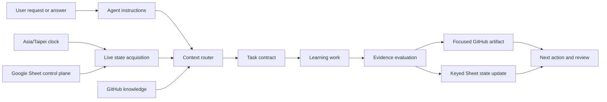

# Repository Structure

```text
agent-architect-notes/
  AGENTS.md                         # Canonical repository instructions for Codex and other agents
  CLAUDE.md                         # Thin Claude Code adapter importing canonical instructions
  README.md
  docs/
    agent-integration/
      README.md                     # Architecture, AIR requirements, boundaries, and definition of done
      SYSTEM_PROMPT.md              # Canonical learning-orchestrator system prompt
      PROMPT_CLASSIFIER_SYSTEM_PROMPT.md # 前置 Prompt Classifier System Prompt
      CONTEXT_ROUTING.md            # Lifecycle/domain/mode/evidence routing and unknown-domain fallback
      STATE_EVIDENCE_CONTRACT.md    # Sheet schema, states, scoring, evidence, review, and persistence contracts
      PROMPT_PLAYBOOK.md            # Reusable invocation patterns for supported clients
      INTEGRATION_TESTS.md          # Static, read-only, write, adversarial, and golden-flow qualification
    learning-system/
      README.md
      daily-cadence.md
      roadmap-28-weeks.md
      dashboard-scoring.md
      sheet-schema.md
      leetcode-alg-mental-simulator.md
      first-two-weeks.md
      knowledge-index.md
      prompt-classification-rules.md # Prompt 分類、建構、淘汰與 Telemetry 校準法則
      discord-prompt-catalog.md # Discord Copy Blocks 與 Agent Architecture Issue 應用
      repo-structure.md
      agent-architect-capstone.md
      exercises/
        two-sum-first-task.md
    kb/
      python-interview-foundation.md
      production-live-coding.md
      system-design-index.md
      agent-architecture-index.md
      evals-security-observability.md
    templates/
      daily-session-note.md
      exercise-memory-capsule.md
      system-design-note.md
      adr-template.md
      postmortem-template.md
    adr/
    postmortems/
    eval-reports/
    benchmark-results/
  exercises/
    leetcode/
    production-labs/
    system-design/
    english/
  capstone/
    skill-registry/
    execution-harness/
    agent-runtime/
    eval-platform/
    observability/
    security/
```

## Instruction Discovery

1. A repository agent reads root `AGENTS.md`.
2. Claude Code reads `CLAUDE.md`, which imports the canonical instruction and state-contract files.
3. The learning orchestrator reads `docs/agent-integration/README.md`, `STATE_EVIDENCE_CONTRACT.md`, and `CONTEXT_ROUTING.md` before selecting domain context.
4. A deeper `AGENTS.md` may narrow behavior for a subtree in the future, but it must not silently contradict repository-wide invariants.

Tool-specific adapters stay thin. Canonical behavior belongs in `AGENTS.md` and `docs/agent-integration/`.

## Data Flow



Operational sequence:

1. Read current time and the live keyed Sheet state.
2. Select lifecycle, domain, autonomy mode, and evidence maturity.
3. Load the smallest relevant GitHub context pack.
4. Compile the task contract, assertions, hint policy, evidence, and stop condition.
5. Produce code, tests, explanation, design, recall, or another bounded artifact.
6. Evaluate observable evidence and find the first divergence.
7. When authorized, save long-form evidence to GitHub first.
8. Update the matching Sheet row by stable key and preserve formulas, validation, formatting, and known drift.
9. Re-read both systems and return provider receipts.
10. Schedule the next active recall from actual performance.

A review date in the Sheet is not proof that a scheduler or notification service exists.

## Source Ownership

| Data | Canonical location |
| --- | --- |
| Repository and agent behavior | `AGENTS.md`, `docs/agent-integration/` |
| Schedule, status, scores, and review dates | Google Sheet |
| Long-form notes and evidence | GitHub repository |
| Latest learner answer, blocker, and energy self-report | Current interaction until persisted |
| Domain knowledge | Smallest relevant file under `docs/kb/` or `docs/learning-system/` |

Never use Google Docs as the canonical destination for long-form learning artifacts. The Sheet stores GitHub URLs.

## File Naming

- LeetCode notes: `exercises/leetcode/lc-0001-two-sum.md`
- Production labs: `exercises/production-labs/lab-01-defensive-json-ingestion.md`
- System design notes: `exercises/system-design/sd-01-rate-limiter.md`
- English drills: `exercises/english/e-001-coding-explanation.md`
- ADRs: `docs/adr/adr-0001-title.md`
- Postmortems: `docs/postmortems/YYYY-MM-DD-topic.md`
- Eval reports: `docs/eval-reports/YYYY-MM-DD-topic.md`
- Benchmark results: `docs/benchmark-results/YYYY-MM-DD-topic.md`

## Artifact Rules

- One task, claim, failure, or decision per focused artifact.
- Include a stable Plan or Exercise ID when applicable.
- Include the trigger, contract, assumptions, evidence locator, result, known limits, first divergence, next action, and review date.
- Use repository-relative links and reproducible commands.
- Do not add secrets, raw credentials, private production data, or an unstated local absolute path.
- Create the target file before adding it to an index.
- Re-read every changed file and verify exact path casing.

## Indexing Flow

1. Create or update the focused GitHub artifact.
2. Receive a provider commit SHA.
3. Verify the artifact at that commit.
4. Add or update its path in `GitHub Docs Index` or `Knowledge Index` when appropriate.
5. Write its GitHub URL to the exact keyed execution row.
6. Re-read the changed row and return a persistence receipt.

Do not create an index entry for a file that does not yet exist.

## Governance Changes

A change to `AGENTS.md`, `CLAUDE.md`, or `docs/agent-integration/` must:

1. Identify affected `AIR-###` requirements.
2. Describe compatibility or migration impact.
3. Keep tool adapters thin.
4. Update the relevant scenarios in `docs/agent-integration/INTEGRATION_TESTS.md`.
5. Report known schema drift rather than silently normalizing live data.
